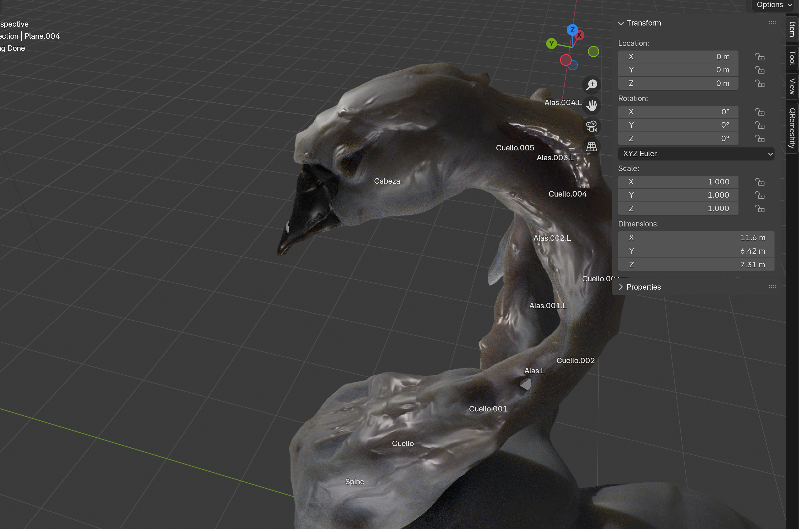

Produced digital content for Nina Ban’s single “Con los Ojos”, including reels, cover art, and press photography. As part of the visual strategy, I developed a fully rigged 3D swan, which was integrated into the photography and motion assets to create a cohesive and impactful visual identity for the artist.

My 3D pipeline for this project involved blocking, sculpting, retopology, and rigging in Blender, followed by multiresolution-based heightmap generation and advanced texture work in Substance Painter. This method ensured both technical precision and high visual impact, allowing the swan to seamlessly blend into the digital content and reels.

Located and directed the shoot, capturing photography and video footage, which I then edited and enhanced in Photoshop. The 3D swan was animated in Blender and integrated into the video assets using After Effects, creating a seamless blend of live action and digital content with a strong visual impact.

