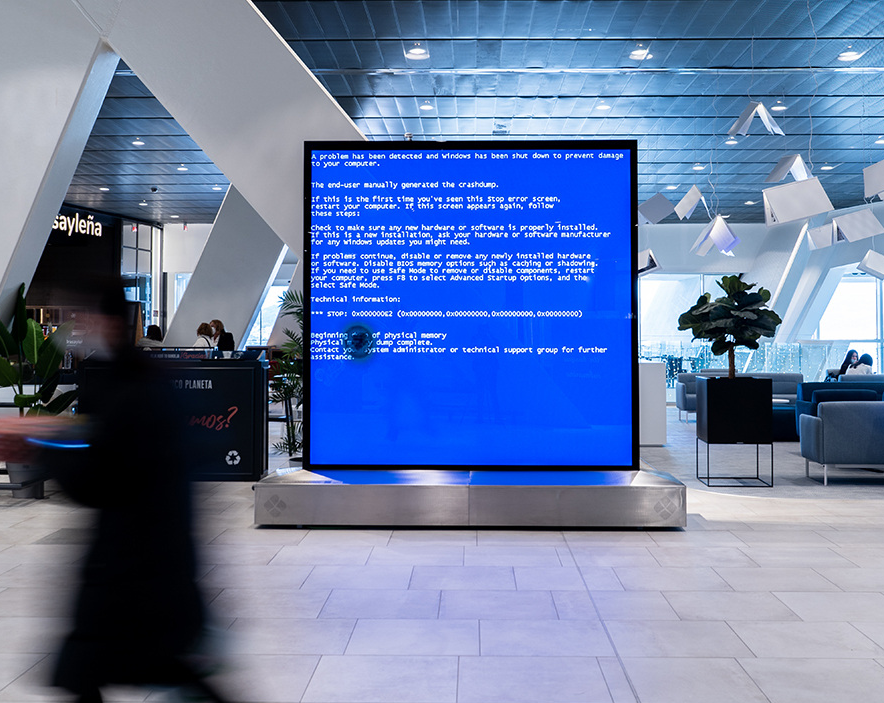
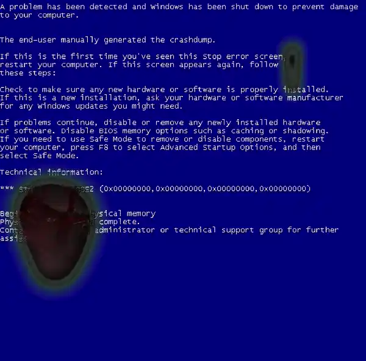

<h3><a href= "https://www.youtube.com/watch?v=5y4j1W-BjA4&ab_channel=AlejandroVazquez"> See the full video</a><h3>

 It is very complicated to find ourselves in this fast-paced world. Sometimes we seem to find ourselves in nothing, other times we find ourselves in everything at once. Sometimes we need a mistake, something that stops us long enough to be able to see the landscape, our own emotional landscape. "Rain, Steam, and Speed" by Turner seems today like a providential work that shows how successive technological advances have diluted real space, like loose brushstrokes on a canvas.

<h3>The world is spinning faster and faster, and the new ability to find ourselves anywhere and nowhere at the same time through a screen only blurs the lines that used to give us some kind of certainty about where our feet are standing.</h3>

Living in a world without certainties and through screens sometimes generates the need to create our own safe space. A landscape that exists, not as the representation of a material and tangible place, but as the delimitation of a comfortable plot within an intangible world that is in unfathomable and incomprehensible at a deep level, we need a comfort net, a habitable space within the immense aridity of the post-digital era.
