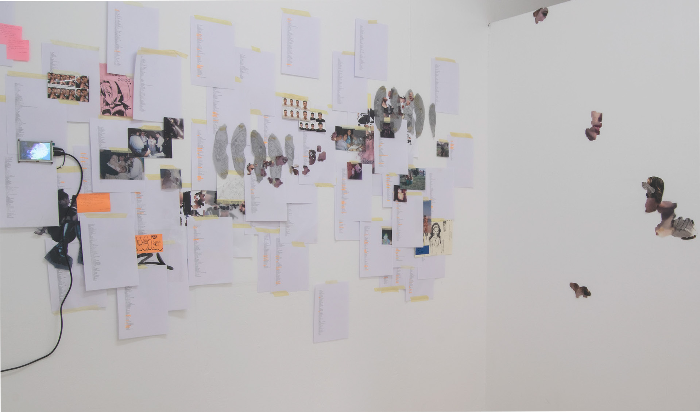

<h3>Why build a space of anonymity about ourselves?</h3>

The main reason is the pressing need to self-represent in the almost infinite space that is the internet, when the personal becomes collective. "It helps us exist under the gaze of others." We need to feel understood within the emptiness of the vastness, especially when traditional collective spaces (the church, the union, the family) seem less solid. In another sense, this search for validation also brings a constant pressure: feeling watched, the relentless competition with our peers, comparisons with "influencers," and the factory of meticulously constructed images that they create, are just some of the examples of the issues stemming from this new need for self-representation. In this context, the need for the alter ego arises, whether it is an avatar in Second Life, a Twitter account with no profile picture, or our personal account on Instagram.

<h3>We need someone else to relate to others through them, we need our reflection to distance ourselves from ourselves so as not to feel the pressure that “being” in the information age really demands of us.</h3>

This new constitution of our identity does not give rise to false identities far from us, nor does it simply turn us into the labels to which we adhere, but neither do we define ourselves only in a “radical” way through individual experiences or our participation in religious or political groups.We are now hybrids between what we are and our non-experiences, we do not sculpt ourselves through fiction or our reality but from the symbiosis of both social and cultural natures of the individual and the more actual subject.

