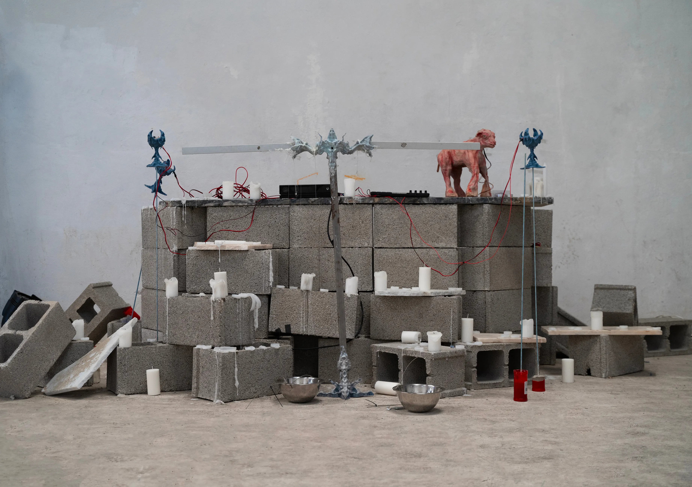
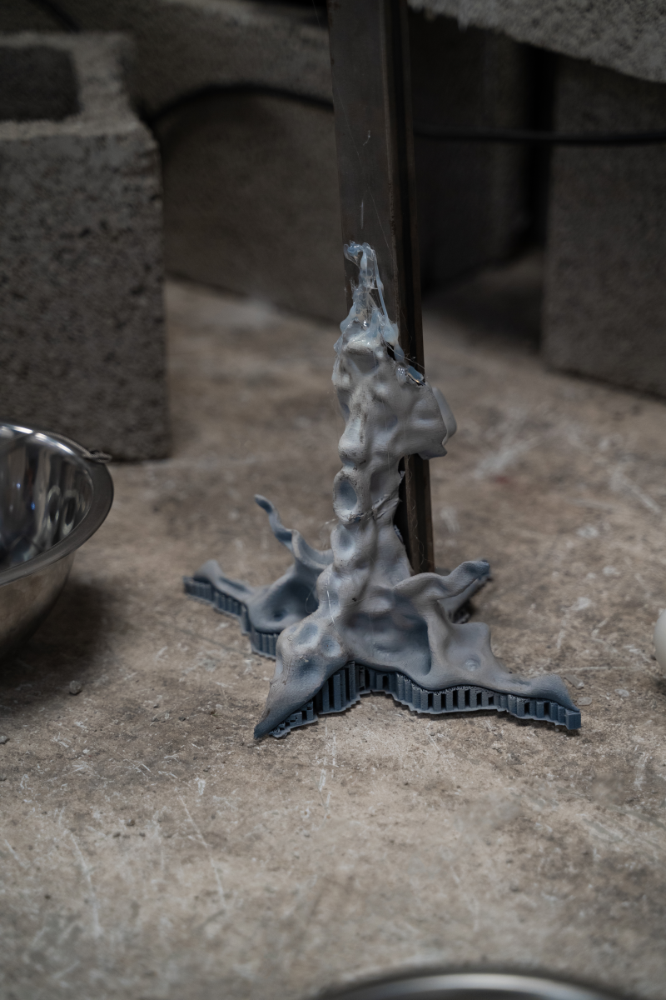
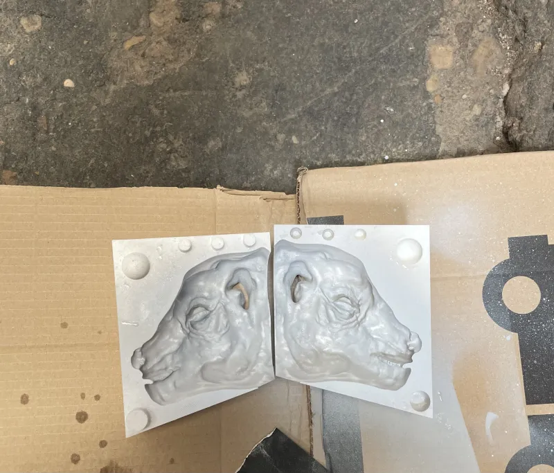
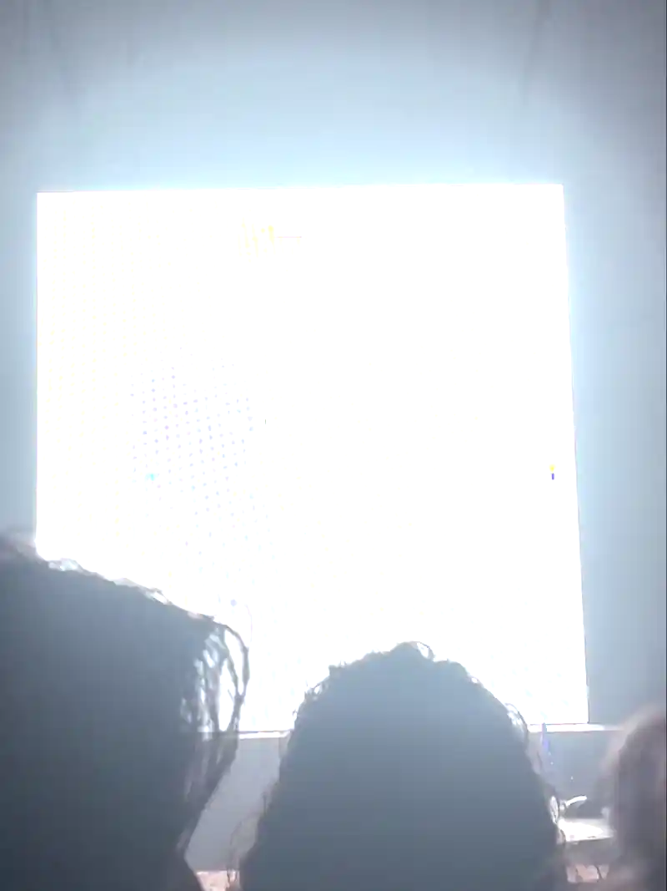

<h3>Photograhy by  <a href="https://www.instagram.com/errandoestamostodos/">Nacho Errando-@errandoestamostodos</a>- at <a href="https://www.instagram.com/pluto______________/">@Pluto</a></h3>
<h3>Music by  <a href="https://www.instagram.com/sangfredaa/"> SANG FREDA</a></h3>

<h3>It seems like a long, stone-cold night is arriving</h3>

In the current state of affairs, it is really difficult to imagine a plausible future—especially one that does not fall into the dystopian category. Neoliberal systems are devouring themselves, and theories like **techno-feudalism**, proposed by Yanis Varoufakis, are becoming increasingly popular online.

The promise of a free and interconnected world has been demolished by powerful economic forces, which have constructed a vast **corpus** of interconnected systems that, through hardware, link our bodies with **big** algorithms designed to influence our behavior. Big Tech exploits our desire to enrich itself.

This framework created by the great technologies takes the form of Deleuze's body without organs insofar as “It is not God, but quite the opposite. However, the energy that runs through it is divine, when it attracts all production and serves as a miraculous surface...”

Our goal is to make a ritual that channels the light of our desiring energy in a place outside the mechanics established by the big technological companies, for this we mix contemporary symbolic elements of our consumer logic with elements of religious-medieval iconographies to create ruptures in the continuum of the logical structures that we have established.

 Hardware is the mediator between our bodies and the algorithms, its chips concentrate, redistribute and redirect our energy so that complex software can analyze it. That's why our first design idea is to design an alternative “body” to a hardware device, to create new interactions with the digital image, to make them appear in different ways than the hardware devices that respond to the established commands. 

So we built a sculptural MIDI device in the shape of a lamb that collects touch signals in the neck area and proximity signals in its head. The device is based on an ESP32 microcontroller running on battery and sending the signals via bluethooth. The sculpting was done in Blender and then two molds were designed for 3D printing and subsequent latex vulcanization. 

The images chosen for the visuals oscillate between the subtleties of natural beauty to constructed postmodern productions, from surveillance images to intervened consumer images. They all appear and disappear, without apparent formality, but at the same time mimic the contemporary experience of the image as a formless cluster of information, that logic we baptize as content. 
