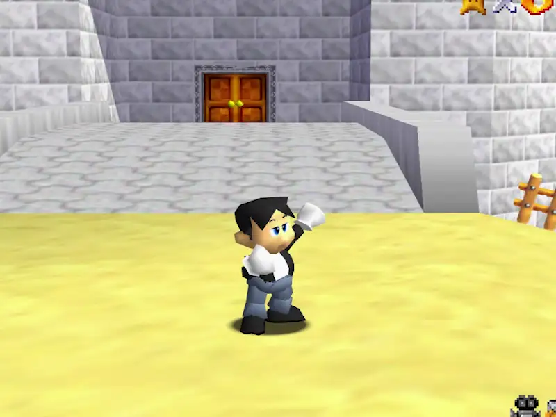
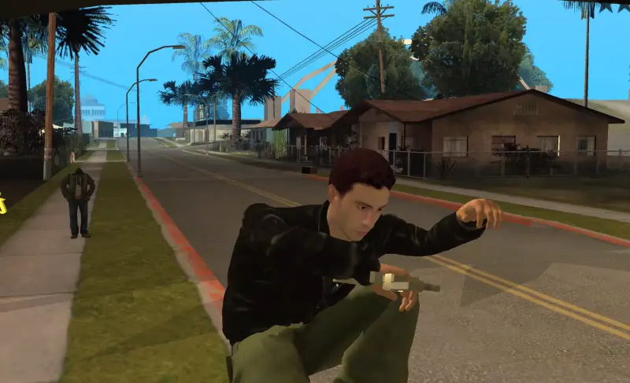

<h3>I am someone like anyone else, probably for some advertising algorithm there is someone exactly like me, I am like another demographic profile. What do I have left to define myself to others? What do I have left to define myself?</h3>

Defining ourselves is complex. We are not only our reflection, our identity is made up of remnants, micro-narratives of ourselves that we build from the reappropriation of small elements of the cultural currents  we consume every day. The flow of images that we have to watch every day has materialized at a level that exceeds the real, the images are no longer a window through which to look as voyeurs, but a comfortable place to inhabit. They are a part of us that we mold to our measure in order to identify with them. 

In this world of images we cannot think of ourselves as a single thing, we are more than the sum of our real sensitive experiences: we are a collection of sketches from here and there, of blurred projections, of pop figures and influencers. Thanks to the online experience we have not only our life, but also all the others we find desirable, all the ones we want to live.

<h3>Thus we come to live two separate experiences: on the one hand our typical sensitive experience and on the other that of image, seduction and fantasy. These two lives tend to hybridize in different ways, the world of the image creates aspirations for us in our sensitive experience, and we translate that sensitive experience into image and story from the cultural molds of the image, creating an alter ego of ourselves. </h3>

How do we relate to this alter-ego, how real or fictitious are our projections of it? How do we empower ourselves through the image? How does projecting ourselves into the image lead us to relationships of self-hatred by comparison? How does the image serve to channel impulses such as violence? How do we find this taste for it through culture? 

It is curious how at this moment in which self-representation is something so commonplace, it is the moment when it is perhaps the most complex for us to disentangle ourselves and present ourselves in a profound way. This is perhaps due to the great spaces of contradiction that arise in our relations with the image, be it our own or that of others. 
