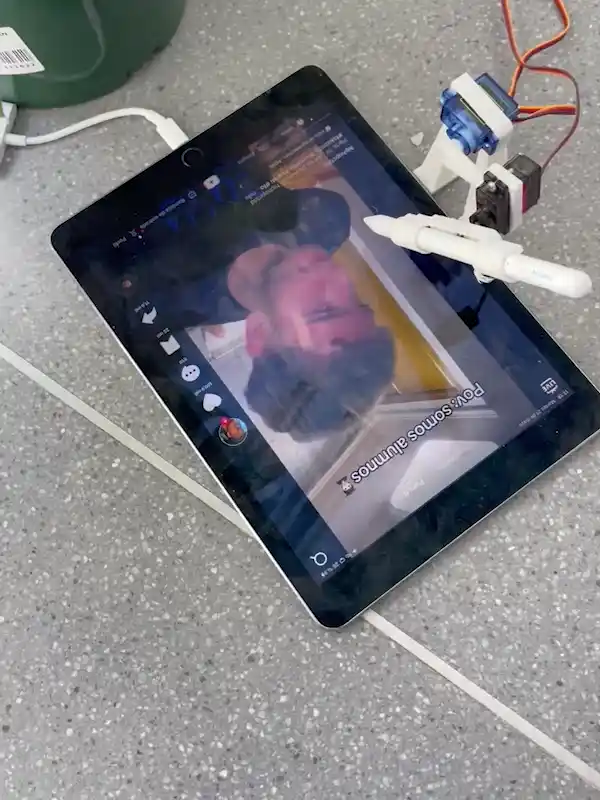
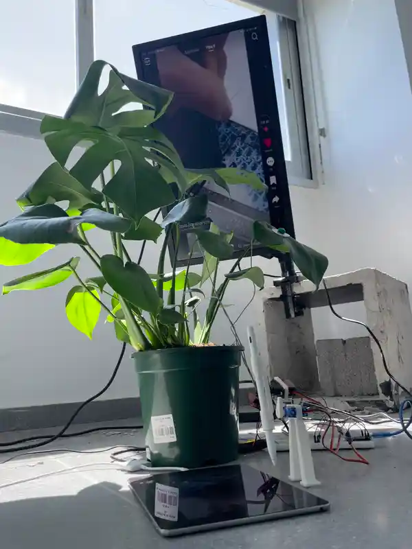

<h3>“No mind, no greed, no suffering No thought, no hurt, no hands to reach...”</h3> 

 In this way Michael Gira draws what it would be like to take a screenshot of our life, to be able to suspend ourselves in time for a moment, to blur the continuity of the world in order to live free of drives. 

<h3>The platforms that follow the TikTok model offer a nightmarish version of this “screen capture” idea , the moment you are in front of its content scroll your existence is annulled to live in a continuous present.</h3>

This continuous present builds itself in the form of a conversation between us, the users, and the algorithm: a conversation in which, through our most basic cognitions, the algorithm mechanizes our desires to make portraits of its users in the form of interests for advertisements. 

<h3>The user-algorithm conversation is constructed so simply that, through mediation devices, we could have non-human biotic entities play the role of the user in it. This is the exercise of symmetry that this piece intends to do, to establish a system that mediates between a plant and the algorithm. </h3>