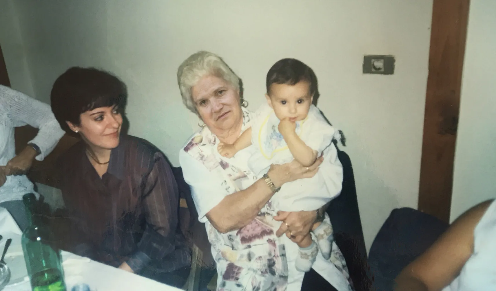
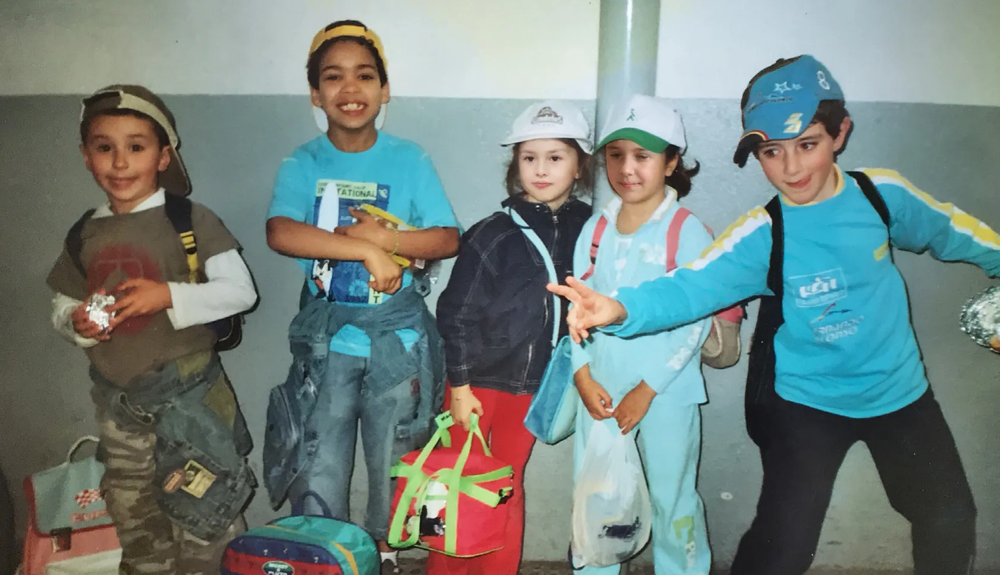

Derrida in “Archive fever” exposes  the archive as a social construction “fever” that establishes how we perceive “history” and therefore our perception of the past, based on this idea of the perversity of memory I wanted to falsify my personal archive, in way of my own family photo album, by vandalizing it.

The constructions and staging that represent the photos of the archive create a layer of hyperreality that replaces the real perceptions that we have stored in our volatile memory, which are full of doubts and subjectivities, so I wanted to attack all this supposed objectivity by modifying and sowing typical doubts that do exist in my subjective memory.

The selection of photos goes chronologically from my baptism to my communion which are the birth and the beginning of adulthood, respectively, for the Christian religion, for this reason, because I was a child, I am unable to recognize many of the people who appear in the photos that I have been able to find in my battered archive, for me they are completely empty shells, random faces. This identity void seemed to me ideal to introduce faces generated by the AI of <a>https://www.thispersondoesnotexist.com</a> .

The intelligence of “This person does not exist” generates completely plausible human faces.the ability of a machine to generate human faces makes us wonder to what extent the false reality we have constructed can make a kind of symbiosis with our tangible reality, new plots of hyperreality reminiscent of the dystopian science fiction of films like Ghost in the Shell or Blade Runner.

Superimposing these empty faces generated by the machine on top of diluted identities in my family album memory dehumanizes the “real” people and gives humanity to those generated by an algorithm, adding a sort of replicants to my family album.

I found it interesting to show the process in an open way, that is to say to make visible and clear that it is a photomontage in some of the photos while it is more polished in others to sow doubts about the veracity of these photographic memories, inspired by the aesthetics of deepfaking.

The iconoclastic technological attack on memory is not only an attack on personal history and fixed identity constructs, but also serves to open questions about how much is real and how much is construct, or digital, in our environment and how what we consider reality is a confused mass of information.

