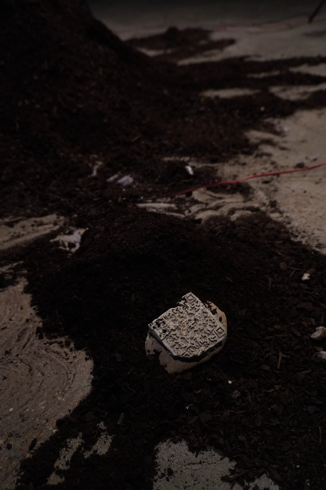

My siblings and I only know eucalyptus forests;
we, and those who come after us, will grow up under the glow of screens and the heat of graphics cards.

In the last century, the Galician forest has changed profoundly: eucalyptus, a foreign species, has become the main tree of the region’s woodlands.

The proliferation of eucalyptus in Galicia has to do with a clear intention to maximize the productivity of its forest tracks. Eucalyptus withstands frost and grows very quickly, which makes it a perfect candidate to make the forest more profitable.

That the forest tracks of the region where I grew up are mediated by profitability means that what I conceptually consider “natural” is controlled by an economic model whose priority is to maximize profits. Having been born after the shifts toward neoliberalism, it is only possible to know a reality mediated by the Hayek–Friedman model.

Eucalyptus trees are strange trees—very tall, thin, and pale; their shape already evokes an image of death. They are toxic trees that acidify the soil, minimize the biosphere, and reproduce like an invasive species. They are trees, yes, but ones that do not bring with them the beneficial qualities that other trees do; they reproduce uncontrollably, making the soil in which they spread uninhabitable for many other species of fauna and flora. They operate in the same way as many synthetic products created and promoted by speculative capitalism.

The neoliberal model can mediate everything from the forest floor to the completely immaterial.

In this coordinate system, it is not only material resources like forest tracks that are optimized; instead, we see far more pressing optimizations in the realm of the “social.” An example of this is the optimization of images and the way we consume them on social networks.

The predominant infinite-scroll model of social media platforms works as a perfect Skinner box, accumulating vast amounts of user data to personalize their experience and offer content that maximizes their screen time.

But the design of the algorithm not only conditions how content is consumed—it also conditions how it is created. The professionalization of online creation has led content producers to sanitize or directly atomize their content or production dynamics to the platforms’ dictates. In the best cases, creative desire is terraformed into pseudo-viral algorithmic operativity; in the worst, propaganda disguises itself as videos with hardcore remixes of 2000s music.

One of the main requirements for pleasing the algorithms is the quantity of content that must be uploaded to the platforms, usually operating under a “the more, the better” logic. Following this logic, many actors within the platform conglomerate have begun constructing bodiless users who upload content to social networks.

These users are Python scripts running on computers or iPhone boards, the so-called “content farms”—profiles that upload videos automatically or semi-automatically, at a pace a human could hardly match. These farms are the next step in the atomization of online content: machines built to feed other machines. Machines designed to generate capital, whether social or economic.

Content generated by these farms tends to be what internet slang calls “sludge content” or “brain-rot,” content of low value in almost every respect except in its ability to retain attention. Pastiches of viral videos with clips of knives cutting sand; videos “targeted” at children in which Cristiano Ronaldo and Messi fight over bags of money; among many other examples of clearly strange content optimized for the algorithm.

The videos generated by these bot farms are not content; they are purely containers. They operate in the same way eucalyptus trees do: hollow inside, conquering the space of other images, proliferating over them, acidifying the soil.

Content farms are proving profitable and useful for many actors involved in the world of social media content, which will surely make them proliferate and their imaginal proposal grow continuously.

We, and those who come after us, will have to grow in eucalyptus forests, on acidic soils, until nothing remains—until the eucalyptus trees or the bots devour themselves, until the system’s growth reaches its limit.

Despite the toxins of eucalyptus, mosses and insects populate the forest tracks of Galicia; they make their home on the fallen trunks of eucalyptus trees. It seems that life can grow even in the most barren places. Perhaps content farms can be reclaimed, infused with a deep desire—can these machines that do not desire be made to desire?

The piece I propose is a chunk of eucalyptus grafted with moss that controls a content farm of Instagram shorts. The more the moss grows, the more the content from the content farm “unravels.”

The very machine that sustains the content farm is the one responsible for keeping the moss alive. This is because relationships are not entirely binary; neoliberal systems gradually insert themselves into the mechanics of the world, swallowing them, hybridizing them. The eucalyptus forest cannot appear as a barren wasteland; that is why the Hayek–Friedman model is interested in having mosses and lichens grow—just as it is interested in controlled dissent in order to absorb it.       