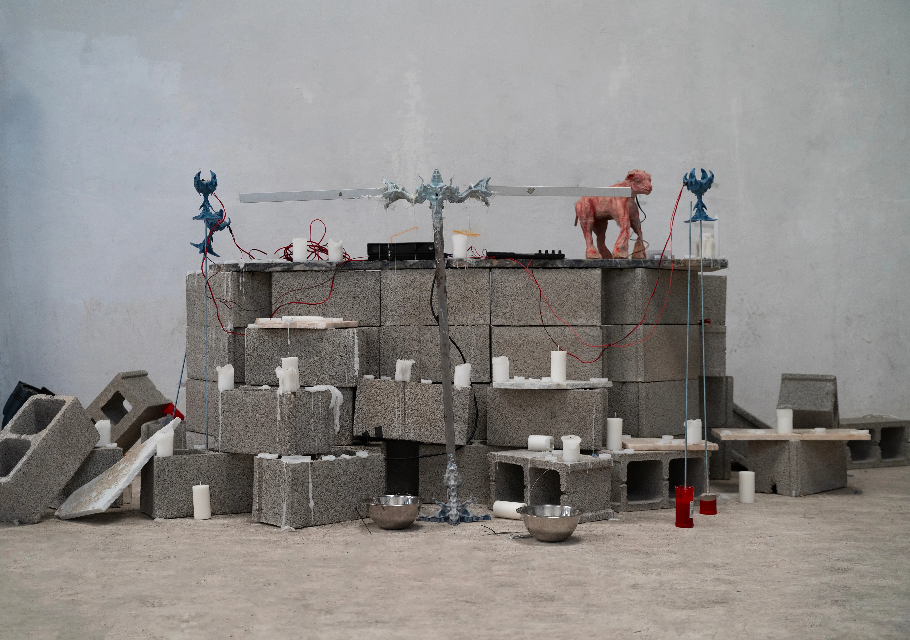
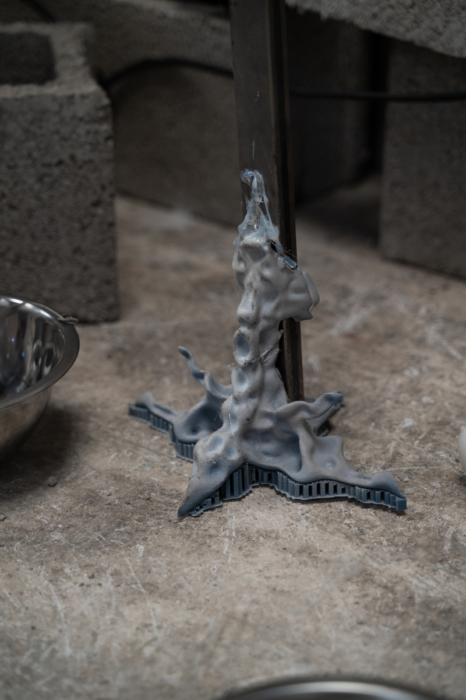

<h3>Foto fija de <a href="https://www.instagram.com/errandoestamostodos/">Nacho Errando-@errandoestamostodos</a>- at <a href="https://www.instagram.com/pluto______________/">@Pluto</a></h3>
<h3>Asistencia y musica de <a href="https://www.instagram.com/sangfredaa/"> SANG FREDA</a></h3>

<h3>Parece que se avecina una larga noche de piedra.</h3>

En el estado actual de las cosas es muy complicado imaginar un futuro posible, y menos uno que no entre dentro del reino de las distopías. El sistema neoliberal parece estar fagocitándose a sí mismo y teorías como el tecno-feudalismo de Yanis Varoufakis parecen estar ganando tracción en redes.

La promesa de un mundo libre e interconectado ha sido aplastada por los grandes poderes económicos, que han construido un corpus  gigante de sistemas interconectados que, a través del hardware, conectan nuestros cuerpos con grandes algoritmos diseñados para condicionar nuestro comportamiento. Las Big Tech aprovechan las capacidades de producción y consumo devenidas de nuestro deseo para enriquecerse. 

Este entramado creado por las grandes tecnológicas toma la forma del cuerpo sin órganos de Deleuze en tanto en cuanto “No es Dios, si no todo lo contrario. Sin embargo es divina la energía que lo recorre, cuando atrae toda la producción y le sirve de superficie milagrosa…”

Una forma de librarnos de este yugo es re-apropiandonos de nuestro deseo, construyendo algo aparentemente improductivo utilizando los ejes de coordenadas establecidos por nuestro sistema actual.
 
Nuestro objetivo es hacer un ritual que canalice la luz de nuestra energía deseante en un lugar fuera de las mecánicas establecidas por las grandes empresas tecnológicas, para esto mezclamos elementos simbólicos contemporáneos de nuestra lógica de consumo con elementos de iconografías religioso-medievales para crear rupturas en el continuo de las estructuras lógicas que tenemos establecidas.

El hardware es el mediador entre nuestros cuerpos y los algoritmos, sus chips concentran redistribuyen y redirigen nuestra energía para que softwares complejos puedan analizarla. Por eso nuestra primera idea de diseño es diseñarle un “cuerpo” alternativo a un dispositivo de hardware, crear nuevas interacciones con la imagen digital, hacerlas aparecer de formas diferentes a como lo hacen los dispositivos de hardware que responden a los ordenes establecidos 

Así construimos un dispositivo MIDI escultórico en forma de cordero que recoge señales de tacto en la zona del cuello y de proximidad en su cabeza. El dispositivo se basa en un microcontrolador ESP32 funcionando mediante batería y enviando las señales vía bluethooth. El esculpido fue hecho en Blender y posteriormente se diseñaron dos moldes para impresión 3D y posterior vulcanizado de Látex. 

Las imágenes escogidas para los visuales oscilan entre  las sutilezas de belleza natural a producciones postmodernas construidas, de la imagen de vigilancia a imágenes de consumo intervenidas. Todas ellas aparecen y desaparecen, sin aparente formalidad, pero a la vez imitan la experiencia contemporánea de la imagen como un clúster sin forma  de información, esa lógica  que bautizamos como contenido 

