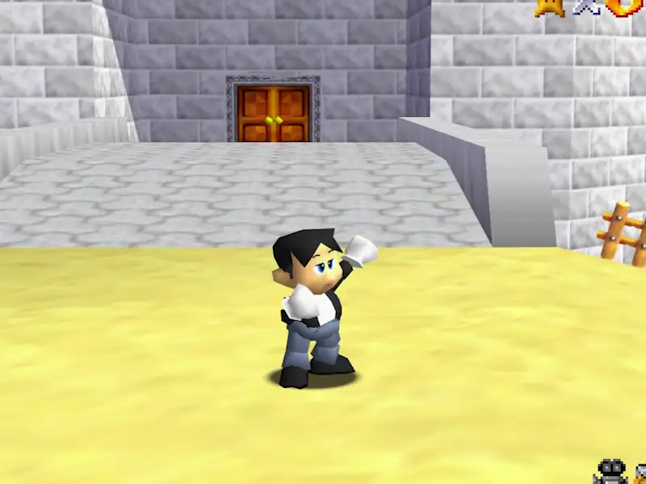
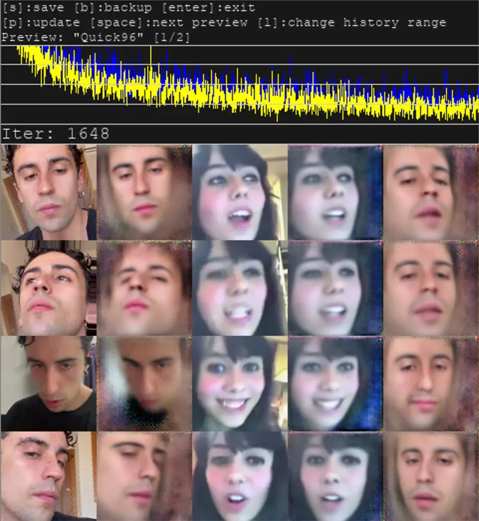
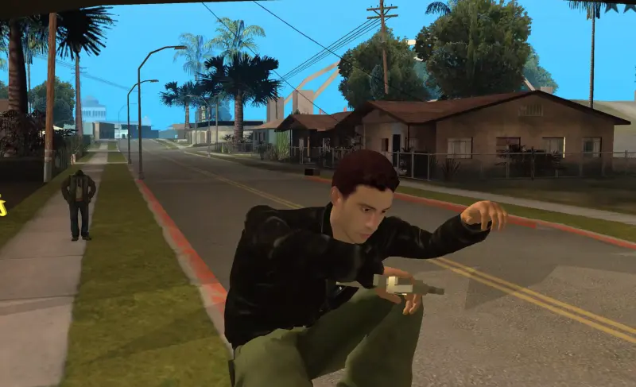
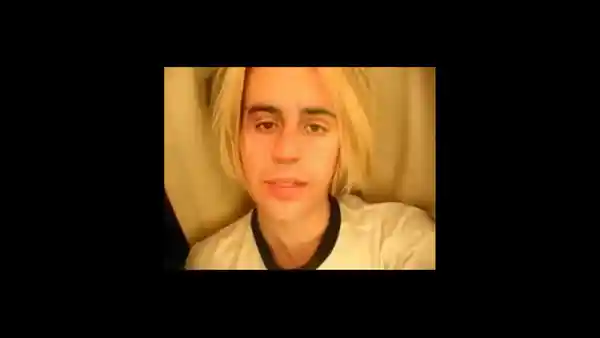

<h3>Soy alguien como cualquier otro, probablemente para algún algoritmo publicitario haya alguien exactamente igual que yo, soy como otro perfil demográfico. ¿Qué me queda para definirme ante los demás? ¿Qué me queda para definirme a mí mismo?</h3>

Definirnos es complejo. No somos solo nuestro reflejo,nuestra identidad está formada por retales, microrrelatos de nosotros que construimos a partir de la reapropiación de pequeños elementos de las grandes corrientes culturales que consumimos cada día. El flujo de imágenes que tenemos que visionar a diario se ha materializado a un nivel que supera lo real, las imágenes ya no nos suponen una ventana a través de la que mirar como voyeurs, si no un lugar cómodo en el que habitar. Son una  parte de nosotros que amoldamos a nuestra medida para poder identificarnos con ellas. 

En este mundo de imágenes no podemos pensarnos como una sola cosa, somos más que la  suma de nuestras experiencias sensibles reales: Somos un conjunto de bocetos de aquí y de allá, de proyecciones desdibujadas, de figuras pop e influencers. Gracias a la experiencia online no tenemos solo nuestra vida, también todas las demás que nos parecen deseables, todas las que queremos vivir.

<h3>Así pasamos a vivir dos experiencias separadas:  por un lado nuestra experiencia sensible típica y por otro la de la imágen, la seducción y la fantasía. Estas dos vidas  tienden a hibridarse de diferentes formas, el mundo de la imagen nos crea aspiraciones en nuestra experiencia sensible, y nosotros traducimos esa experiencia sensible en imágen y relato a partir de los moldes culturales de la imagen, creando un alter ego de nosotros mismos. </h3>

¿Cómo nos relacionamos con ese alter-ego como de reales o de ficticias son nuestras proyecciones frente al mismo? ¿Cómo nos empoderamos a través de la imágen? y ¿Cómo proyectarnos en la misma nos lleva a relaciones de autoodio por comparación? ¿ Cómo la imágen sirve para canalizar pulsiones como la violencia? ¿ Cómo encontramos ese gusto por la misma a partir de la cultura ? 

Es curioso como en este momento en el que la autorepresentación es algo tan cotidiano sea el momento donde quizás más complejo nos resulte desentramarnos a nosotros mismos y presentarnos de manera profunda. Esto quizás sea por los grandes espacios de contradicción que se plantean en nuestras relaciones con la imagen, sea la nuestra o la de los otros. 
