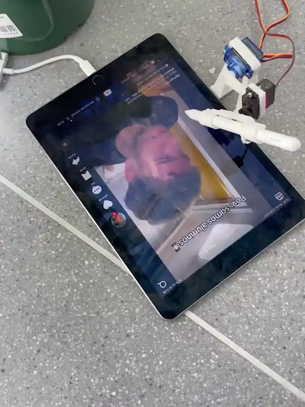

<h3>“No mind, no greed, no suffering No thought, no hurt, no hands to reach…”<h3>

Así Michael Gira dibuja cómo sería hacer una captura de pantalla de nuestra vida, poder suspenderse en el tiempo por un momento, desdibujar la continuidad del mundo para vivir libre de pulsiones. 

<h3>Las plataformas que siguen el modelo TikTok ofrecen una versión pesadillesca de esta “captura de pantalla”, en el momento en el que estás frente a su scroll de contenido tu existencia se anula para vivir en un presente continuo.</h3>

Este presente continuo se construye en la forma de una conversación entre nosotros, los usuarios y el algoritmo.Una conversación en la que, a través de nuestras cogniciones más básicas, el algoritmo mecaniza nuestros deseos para hacer retratos de sus usuarios en forma de intereses para anuncios. 

<h3>La conversación usuario-algoritmo se construye de forma tan sencilla que, mediante dispositivos de mediación, podríamos hacer que entes bióticos no humanos hicieran el papel de usuario en la misma. Este es el ejercicio de simetría que pretende hacer esta pieza, establecer un sistema que medie entre una planta y el algoritmo </h3>
